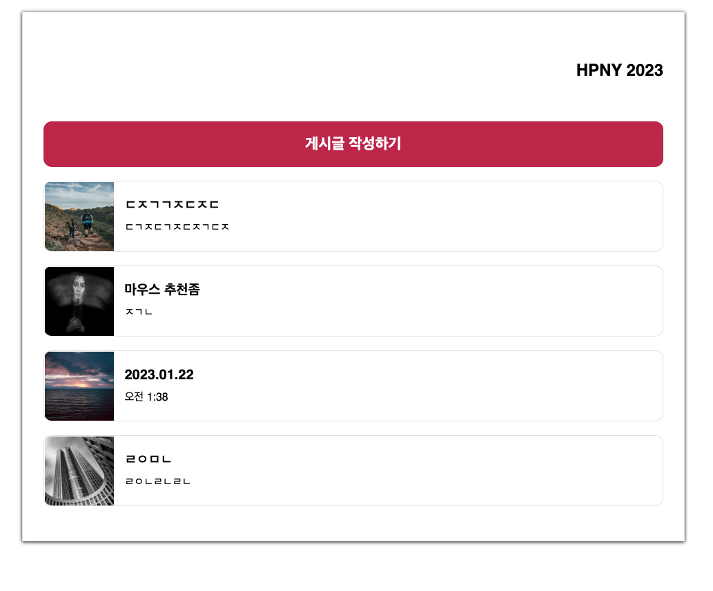
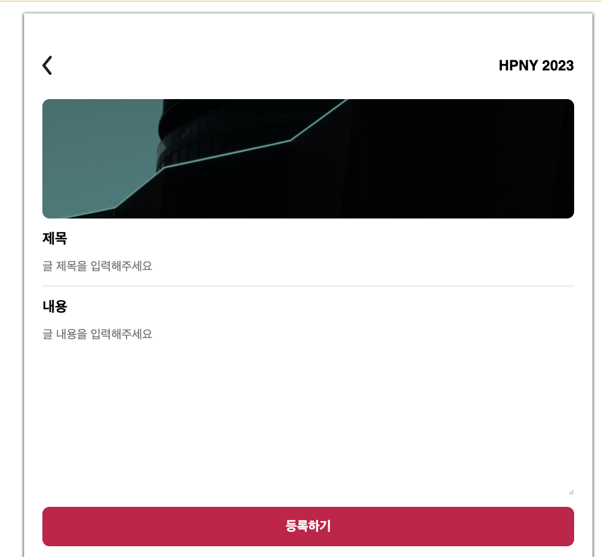

# SPA with Vanilla JS

Creating Simple CRUD to share our happy new year moment including comments etc.
## What I learned

- Differences between Declarative / Imperative programming
- How important it is to managing directory
- SPA's Behind-Scene with using React-like library or framework.

## RESULTS

### This is Homepage 

You can check both posts which redirect based on the post-id or create one.

 

Generating your post

 

You can see there are comments section with also CRUD

 

Comments

